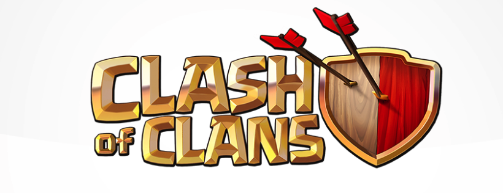

# Clan War League Leaderboard

A full-stack MERN application for tracking and ranking Clash of Clans war performance. Create your clan, add players, log war stats, and watch live rankings update in real-time!



## ✨ Features

- **🏰 Clan Management** - Create and manage your own clan
- **⚔️ War Tracking** - Track 7 concurrent wars with detailed stats
- **📊 Live Leaderboard** - Real-time rankings based on net stars and percentages
- **👥 Player Roster** - Add and remove players from your clan
- **📥 CSV Export** - Export leaderboard data for analysis
- **🔐 Authentication** - Secure login/signup with JWT tokens
- **🌐 Public Directory** - Browse and view any clan's leaderboard
- **📱 Responsive Design** - Works seamlessly on desktop and mobile

## 🛠️ Tech Stack

### Frontend
- **React 18** - UI library
- **Vite** - Build tool and dev server
- **Vanilla CSS** - Custom styling with animations

### Backend
- **Node.js** - Runtime environment
- **Express.js** - Web framework
- **MongoDB** - Database
- **Mongoose** - MongoDB ODM
- **JWT** - Authentication tokens
- **bcrypt** - Password hashing

## 📦 Local Development

### Prerequisites
- Node.js (v18 or higher)
- MongoDB (local or Atlas connection)

### 1. Clone the repository
```bash
git clone https://github.com/Amardipy10/CWL-LEADERBOARD.git
cd CWL-LEADERBOARD
```

### 2. Install dependencies

**Server:**
```bash
cd server
npm install
```

**Client:**
```bash
cd client
npm install
```

### 3. Environment Setup

Create a `.env` file in the `server` directory:

```env
PORT=5000
MONGO_URI=mongodb://127.0.0.1:27017/coc-war-leaderboard
JWT_SECRET=your_super_secret_key_here
NODE_ENV=development
FRONTEND_URL=http://localhost:5173
```

### 4. Start the Development Servers

**Terminal 1 - Backend:**
```bash
cd server
npm run dev
```

**Terminal 2 - Frontend:**
```bash
cd client
npm run dev
```

The application will be available at:
- Frontend: `http://localhost:5173`
- Backend API: `http://localhost:5000`

---

## 🚀 Production Deployment

### Deploying Backend to Render

1. Go to [Render Dashboard](https://dashboard.render.com)
2. Click **"New +"** → **"Web Service"**
3. Connect your GitHub repository
4. Configure the service:
   - **Name:** `cwl-leaderboard-api`
   - **Root Directory:** `server`
   - **Runtime:** `Node`
   - **Build Command:** `npm install`
   - **Start Command:** `npm start`
5. Add environment variables:
   | Key | Value |
   |-----|-------|
   | `NODE_ENV` | `production` |
   | `MONGO_URI` | Your MongoDB Atlas connection string |
   | `JWT_SECRET` | A secure random string |
   | `FRONTEND_URL` | Your Vercel frontend URL (e.g., `https://your-app.vercel.app`) |

6. Click **"Create Web Service"**
7. Copy your Render URL (e.g., `https://cwl-leaderboard-api.onrender.com`)

### Deploying Frontend to Vercel

1. Go to [Vercel Dashboard](https://vercel.com/dashboard)
2. Click **"Add New..."** → **"Project"**
3. Import your GitHub repository
4. Configure the project:
   - **Root Directory:** `client`
   - **Framework Preset:** `Vite`
   - **Build Command:** `npm run build`
   - **Output Directory:** `dist`
5. Add environment variable:
   | Key | Value |
   |-----|-------|
   | `VITE_API_BASE` | Your Render backend URL (e.g., `https://cwl-leaderboard-api.onrender.com`) |

6. Click **"Deploy"**

### Post-Deployment

After deploying both services:
1. Go back to **Render** → Your service → **Environment**
2. Update `FRONTEND_URL` with your actual Vercel URL
3. Click **"Save Changes"** to trigger a redeploy

---

## 📁 Project Structure

```
├── client/                 # React frontend
│   ├── src/
│   │   ├── assets/        # Images and SVGs
│   │   ├── components/    # Reusable components
│   │   ├── App.jsx        # Main application
│   │   ├── main.jsx       # Entry point
│   │   └── styles.css     # Global styles
│   ├── vercel.json        # Vercel configuration
│   └── vite.config.js
│
├── server/                 # Express backend
│   └── src/
│       ├── middleware/    # Auth middleware
│       ├── models/        # Mongoose schemas
│       ├── routes/        # API routes
│       └── index.js       # Server entry point
│   ├── render.yaml        # Render configuration
│   └── .env.example
│
├── .gitignore
└── README.md
```

## 🔌 API Endpoints

### Authentication
| Method | Endpoint | Description |
|--------|----------|-------------|
| POST | `/api/auth/register` | Register a new user |
| POST | `/api/auth/login` | Login and get JWT token |

### Clans
| Method | Endpoint | Description |
|--------|----------|-------------|
| GET | `/api/clans/me` | Get current user's clan |
| POST | `/api/clans` | Create a new clan |

### Players
| Method | Endpoint | Description |
|--------|----------|-------------|
| GET | `/api/players` | Get all players in clan |
| POST | `/api/players` | Add a new player |
| DELETE | `/api/players/:id` | Remove a player |
| PUT | `/api/players/:id/war/:warIndex` | Update war stats |
| POST | `/api/players/reset-war/:warIndex` | Reset war data |

### Public
| Method | Endpoint | Description |
|--------|----------|-------------|
| GET | `/api/public/clans` | List all public clans |
| GET | `/api/public/clans/:slug/players` | Get clan leaderboard |
| GET | `/health` | Health check endpoint |

## 🎮 How Ranking Works

Players are ranked by:
1. **Total Net Stars** (Attack Stars - Defense Stars) - Higher is better
2. **Total Net Percentage** (Attack % - Defense %) - Tiebreaker
3. **Player Name** - Final tiebreaker (alphabetical)

## 🎨 UI Features

- **Glassmorphism Effects** - Modern frosted glass panels
- **Smooth Animations** - Fade-in, slide-up, floating effects
- **Micro-interactions** - Hover states, button ripples, glowing effects
- **Skeleton Loading** - Shimmer effect while loading
- **Responsive Design** - Mobile-first approach
- **Accessibility** - ARIA labels and reduced motion support

## 📄 License

MIT License - feel free to use this project for your own clan!

---

Built with ⚔️ for the Clash of Clans community
